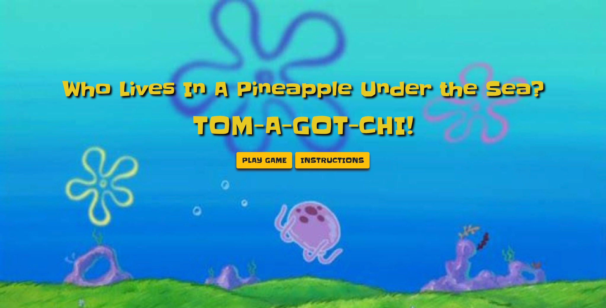
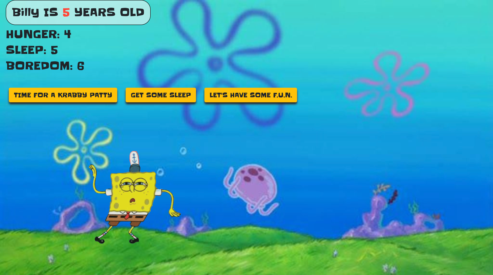

# Spongebob Tamagotchi
#### https://johnzerbe.github.io/tomagotchi-project/
My official first project. I've created a browser-based tamagotchi game using JavaScript. Keep Spongebob alive by feeding him, giving him rest, and playing with him. Last long enough and he'll evolve into different appearances.

# Motivation
As stated above, this is my first official project using JavaScript. After learning some of the fundamentals and concepts of this language, I wanted to put together a simple, yet functional game. I loved watching Spongebob Squarepants as a kid (still do actually), so I thought a simple game such as this needed a light and fun theme. 

# Screenshot #1

# Screenshot #2

# Tech/Frameworks Used
* JavaScript
* HTML
* CSS
* Bootstrap
* jQuery

# Features
* Main menu with play button and intructions modal
* Ability to give tamagotchi a customizable name before gameplay begins
* Timer interval that accumulates point for hunger, playtime, and sleep
* Tamagotchi's age increases using time interval
* Character evolutions as age progresses
* CSS Animation for character movement
* Conditions for both winning and losing

# How to Play
* From the main menu, users may either view instructions or choose to start gameplay
* Upon starting the game, users are prompted to enter a name of their choosing
    * The name entered will be displayed during gameplay
* Tamagotchi's age will be displayed in upper right, starting at zero, and increases gradually
* Tamagotchi's stat categories are 'Sleep', 'Hunger', and 'Boredom'
    * Stats will increase during gameplay, but if any of the categories reaches 10, the game is over
* To reduce stat points, click on the corresponding buttons to either feed, play with, or give the tamagotchi time to sleep.
    * One click will reduce that corresponding stat point by one
* If any of the stat points goes below zero (e.g. overfed, overslept, or too much fun) the player loses.
* Tomagotchi will reach its final evolution at age 8, at which point the player wins.

